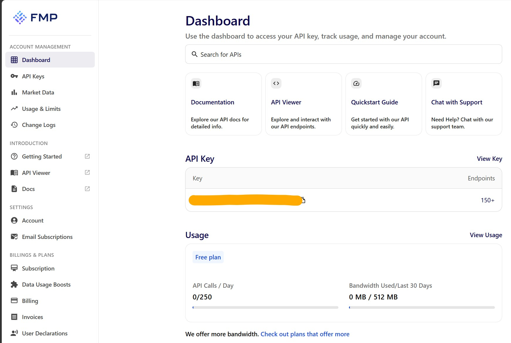
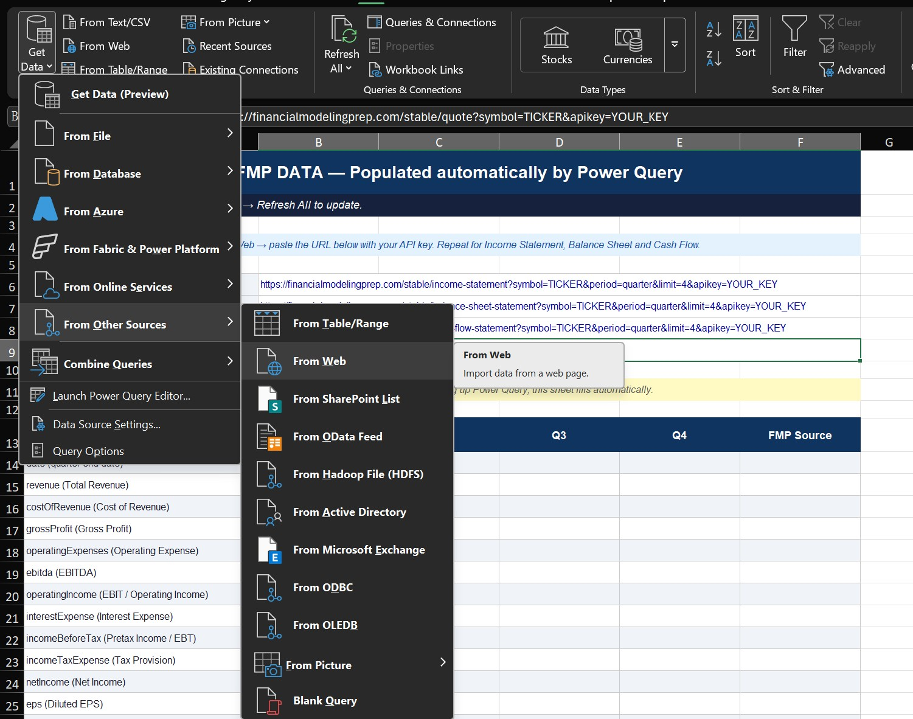

# Fundamental Analysis Templates — Personal Investment Toolkit

A set of Excel templates for analysing stocks and ETFs before investing. Built for individual investors who want to go beyond price charts and understand the business behind each ticker.

> **Disclaimer:** I am not a financial advisor. These templates are for educational and personal use only. All investments carry risk. As my professor of international investment at IPN once defined it: *"Risk is the possibility and probability of three elements: not obtaining the expected gains, not obtaining any gain at all, and even losing everything you invested."* Do your own research before making any financial decision.

---

## What is this?

After investing based mostly on price charts — and learning the hard way that price is not value — I built a structured analysis system I now apply consistently before buying any stock or ETF.

The templates are organised into two types:

- **`AF_Stocks_`** — for individual stocks (US and Mexican markets)
- **`AF_ETF_`** — for exchange-traded funds

Each file follows the same sheet structure and colour logic, so once you learn one, you know them all.

---

## Repository structure

```
fundamental-analysis-templates/
│
├── stocks/
│   ├── AF_Stocks_TEMPLATE_EN.xlsx        ← blank template (start here)
│   └── AF_Stocks_MSFT_EN_202608.xlsx     ← filled example (Microsoft, Aug 2026)
│
├── etfs/
│   ├── AF_ETF_TEMPLATE_EN.xlsx           ← blank template
│   └── AF_ETF_VOO_EN_202608.xlsx         ← filled example (Vanguard S&P 500, Aug 2026)
│
└── README.md
```

---

## Sheet structure

Every stock file contains the following sheets in order:

| Sheet | Purpose |
|---|---|
| `Setup` | Enter your FMP API Key and ticker. Power Query reads from here. |
| `FMP_Data` | Auto-populated by Power Query (US stocks only). Do not edit. |
| `Input_Data` | All financial data in one place. Blue = auto-filled. Yellow = you fill manually. |
| `Analysis` | Calculated ratios with traffic-light signals (🟢 GOOD / 🟡 REVIEW / 🔴 ALERT). |
| `DuPont_Pyramid` | ROE decomposition: Net Margin × Asset Turnover × Financial Leverage. |
| `My_Position` | Personal P&L, Rule of 72 projections, and Buy Zone analysis. |
| `Sector_Benchmark` | Side-by-side comparison with up to 3 competitors. |
| `Guide` | Instructions and ratio glossary. |

ETF files follow the same structure but replace `DuPont_Pyramid` with ETF-specific metrics (expense ratio, tracking difference, AUM).

---

## How the colour system works

| Colour | Meaning |
|---|---|
| 🟡 Yellow fill | **You fill this in manually** — price, P/E, analyst targets, etc. |
| 🔵 Blue fill | **Auto-calculated** — do not edit |
| 🟢 Green signal | Healthy — within normal range |
| 🟡 Yellow signal | Review — worth watching |
| 🔴 Red signal | Alert — outside healthy range |

---

## Getting started

### For US stocks (automated via Power Query)

1. Open `AF_Stocks_TEMPLATE_EN.xlsx`
2. Go to `FMP_Data` and copy Income Statement link
3. Find your key in [FMP API Key](https://financialmodelingprep.com/dashboard) and replace TICKER (e.g. `ADBE`) and YOUR_KEY, copy the full link

4. Go to **Data → Get Data → From other sources → From web **

5. In the query select → **To table** and OK
6. Click on the arrows → OK → **Close & Load**
9. Repeat the process for **Balance Sheet** and **Cash Flow** from **FMP_Data**
10. `Input_Data` populates automatically from `FMP_Data`
11. Fill the yellow cells manually: Share Price, Dividend Per Share, Historical Avg P/E, 52-Week Range, Analyst targets
12. Read the signals in `Analysis`, `DuPont_Pyramid`, and `My_Position`
13. Save as `AF_Stocks_TICKER_YYYYMM.xlsx` (e.g. `AF_Stocks_ADBE_202609.xlsx`)

Limitations: FMP requires a subscription to access most of stocks data, only the most popular ones are for free. So consider doing it manually if you don't want to pay. 

### For Mexican stocks (manual entry)

There is no free API for BMV tickers. Fill `Input_Data` manually:

- **Yahoo Finance or Stockanalysis.com** → search `WALMEX.MX` → Overview tab, Financials tab (income statement, balance sheet, cash flow), Statistics tab, Dividends tab.
- **BMV** → [bmv.com.mx](https://www.bmv.com.mx) → Información Periódica → XBRL quarterly reports
- **GBM or other broker** → your transaction history for purchase price and shares
- **Macrotrends.net** → to compare PE ratio per year

### For other stocks (manual entry)

- **Yahoo Finance** → search `TICKER` → Overview tab, Financials tab (income statement, balance sheet, cash flow), Statistics tab, Dividends tab.
- **Stockanalysis.com** → search `TICKER` → Overview tab, Financials tab (income statement, balance sheet, cash flow), Statistics tab, Dividends tab.
- **Macrotrends.net** → to compare PE ratio per year

---

## Data sources by field

| Field | Source |
|---|---|
| Quarterly financials (US) | [financialmodelingprep.com](https://financialmodelingprep.com) — free tier covers 4 quarters |
| Share Price (current) | [stockanalysis.com/stocks/TICKER](https://stockanalysis.com) → live price |
| P/E Ratio (TTM) | stockanalysis.com/stocks/TICKER → Summary → "PE Ratio (TTM)" |
| Historical Avg P/E | [stockanalysis.com/stocks/TICKER/financials/](https://stockanalysis.com) → PE Ratio column → average last 5 fiscal years manually |
| Forward P/E | stockanalysis.com/stocks/TICKER → Summary → "Forward PE" |
| P/B Ratio | stockanalysis.com/stocks/TICKER → Statistics → "P/B Ratio" |
| 52-Week Range | stockanalysis.com/stocks/TICKER → Summary |
| Analyst targets | stockanalysis.com/stocks/TICKER → Analysts tab |
| ETF Expense Ratio | ETF issuer site (vanguard.com / ishares.com / ssga.com) |
| ETF Tracking Difference | [etf.com](https://www.etf.com) → Efficiency section |
| 30-Day SEC Yield | ETF issuer site → Distributions |

---

## The four analytical sections

### 1. Valuation — Is the stock expensive?
- **P/E Ratio**: years of current earnings per share price. Compare against sector average and the company's own historical average.
- **P/B Ratio**: price paid per $1 of net assets. High values are normal in asset-light tech companies.
- **Buy Zone**: combines P/E vs historical average, price position in 52-week range, and a target entry price formula.

### 2. Profitability — Does it make money?
- **Gross Margin** = Gross Profit / Revenue
- **Operating Margin** = EBIT / Revenue
- **Net Margin** = Net Income / Revenue
- **ROE** = Net Income / Equity → further decomposed via DuPont

### 3. Debt & Solvency — Can it pay what it owes?
- **Current Ratio** = Current Assets / Current Liabilities (>2x comfortable)
- **Debt/EBITDA** (<2x excellent, >5x alert)
- **Interest Coverage** = EBIT / Interest Expense (>3x safe)

### 4. Dividends & Cash — Does it generate real cash?
- **FCF Yield** = Free Cash Flow / Market Cap (>5% attractive)
- **Dividend Yield** = Annual Dividend / Share Price

---

## DuPont Pyramid

The `DuPont_Pyramid` sheet decomposes ROE into three drivers:

```
ROE = Net Margin × Asset Turnover × Financial Leverage
```

This tells you *why* ROE is what it is:
- High **Net Margin** → the company keeps a large share of each dollar of revenue
- High **Asset Turnover** → the company generates a lot of revenue per dollar of assets
- High **Financial Leverage** → the company uses debt to amplify returns (also amplifies risk)

A company with high ROE driven by margins is more sustainable than one driven by leverage.

---

## Naming convention

```
AF_Stocks_TICKER_YYYYMM.xlsx    →   AF_Stocks_MSFT_202608.xlsx
AF_ETF_TICKER_YYYYMM.xlsx       →   AF_ETF_VOO_202608.xlsx
```

---

## Related articles

These templates were built as part of a personal finance project documented on Medium:

- [I Have Been Buying Stocks the Wrong Way](https://medium.com/@salvador.jimenez-juarez) — why I built this system
- [How I Analyse a Stock Before Buying It](https://medium.com/@salvador.jimenez-juarez) — walkthrough using MSFT
- [How I Built a Personal Investment Dashboard in Power BI](https://medium.com/@salvador.jimenez-juarez) — tracking the full portfolio

---

## About

Built by [Salvador Jiménez](https://www.linkedin.com/in/salvador-jimenez97mx/) — Business Analyst and BI professional based in Paris.

Multilingual portfolio (ES · EN · FR) combining financial analysis, Excel modelling, and Power BI dashboards.

Questions or suggestions → open an issue or reach out on LinkedIn.
